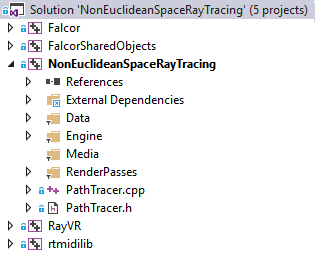
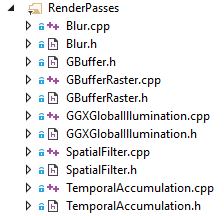
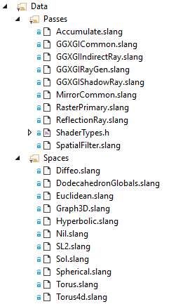
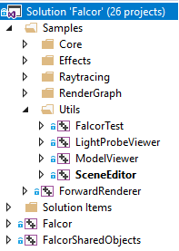

# Ray VR

[Ray VR](https://www.visgraf.impa.br/ray-vr/) is a real-time ray tracer for visualization of euclidean and non-euclidean spaces in VR.

## Project philosophy and organization

The project consists of several repositories (repos from now on) in [vglab-ray-tracing](https://git.impa.br/vglab-ray-tracing). They contain the ray-tracer code, but also prerequisites. We opt to fork prerequisite repos so we have the flexibility to change them to our needs and to merge upgrades when new versions are pushed by developers. Thus, our philosophy is to solve problems in the main ray-tracer repo whenever possible to maintain the changes in the prerequisites to a minimum.

The repos are the following:

- [Ray-VR](https://git.impa.br/vglab-ray-tracing/ray-vr): original main repo, with support for stereo ray tracing of euclidean spaces. Contains the ray-tracer host and shader code and VR device management.
- [Falcor](https://git.impa.br/vglab-ray-tracing/Falcor): prerequisite. Consists of NVidia's scientifical framework and is used as a library to access RTX ray tracing capabilities. Fork of original repo.

## Setup and building

### Ray-tracer

The system must be set up for Falcor. We reproduce Falcor's prerequisites here and refer to [Falcor's readme](https://git.impa.br/vglab-ray-tracing/Falcor) for more details.

```
Prerequisites
------------------------
- GPU that supports DirectX 12 or Vulkan
- Windows 10 RS2 (version 1703) or newer, or Ubuntu 17.10

On Windows:
- Visual Studio 2017
- [Microsoft Windows SDK version 1809 (10.0.17763.0)](https://developer.microsoft.com/en-us/windows/downloads/sdk-archive)
- To run DirectX 12 applications with the debug layer enabled, you need to install the Graphics Tools optional feature. The tools version must match the OS version you are using (not to be confused with the SDK version used for building Falcor). There are 2 ways to install it:
    - Click the Windows button and type `Optional Features`, in the window that opens click `Add a feature` and select `Graphics Tools`.
    - Download an offline pacakge from [here](https://docs.microsoft.com/en-us/windows-hardware/test/hlk/windows-hardware-lab-kit#supplemental-content-for-graphics-media-and-mean-time-between-failures-mtbf-tests). Choose a ZIP file that matches the OS version you are using. The ZIP includes a document which explains how to install the graphics tools.

DirectX Raytracing 
-------------------------
Falcor 3.0 added support for DirectX Raytracing. As of Falcor 3.1, special build configs are no longer required to enable these features. Simply use the `DebugD3D12` or `ReleaseD3D12` configs as you would for any other DirectX project.
The HelloDXR sample demonstrates how to use Falcor’s DXR abstraction layer.

- Requirements:
    - Windows 10 RS5 (version 1809)
    - A GPU which supports DirectX Raytracing, such as the NVIDIA Titan V or GeForce RTX (make sure you have the latest driver)

Falcor doesn’t support the DXR fallback layer.
```

After Falcor's prerequisites are met, Ray VR setup is quite easy. In Git Bash, type the following instructions:

```
1. git clone git@git.impa.br:vglab-ray-tracing/ray-vr.git
2. cd ray-vr
3. git submodule init
4. git submodule update
```

> You will be prompted for password to clone the repositories.

At this point the project can be compiled. To do that:

1. Open `Ray-VR.sln` using Visual Studio 2017.
2. Select `ReleaseD3D12` or `DebugD3D12` in the build configuration.
3. `Ctrl + Shift + B` to build.


> Attention: Compilation will fail for any other build configuration!

## Solution organization

The Visual Studio solution is `Ray-VR.sln`. It has the following structure:



The projects in the solution match the repositories described earlier. `Ray-VR` is organized in several folders and a main class:

- `Data` contains all files that must be copied to the executable folder (shaders for example). Falcor unsures the copy at compilation time.
- `Engine` contains classes that solve auxiliary problems, such as avatar creation, VR controller management, etc.
- `Media` contains model files (.fbx, .obj), Falcor scene files (.fscene) and RayVR files (.rayvr).
- `RenderPasses` contains `RenderPass` inherited classes, which are used by the `RenderGraph` objects. More on that later.
- `PathTracer` class, which inherits from `Renderer` (Falcor's sample class).

### `PathTracer`

`Renderer` defines an event API so Falcor samples can be easily created. `PathTracer` overrides the necessary methods, which can also be seen as an overview of it.

```cpp
class PathTracer : public Renderer
{
public:
	void onLoad(SampleCallbacks* pSample, RenderContext* pRenderContext) override;
	void onFrameRender(SampleCallbacks* pSample, RenderContext* pRenderContext, const Fbo::SharedPtr& pTargetFbo) override;
	void onShutdown(SampleCallbacks* pSample) override;
	void onResizeSwapChain(SampleCallbacks* pSample, uint32_t width, uint32_t height) override;
	bool onKeyEvent(SampleCallbacks* pSample, const KeyboardEvent& keyEvent) override;
	bool onMouseEvent(SampleCallbacks* pSample, const MouseEvent& mouseEvent) override;
	void onDataReload(SampleCallbacks* pSample) override;
	void onGuiRender(SampleCallbacks* pSample, Gui* pGui) override;

  ...
}
```

Each method is called by Falcor when the associated event occurs. For example, `onLoad()` is a callback called once at Falcor startup, `onFrameRender()` is a callback for rendering the frame (so Falcor ensures that it is called in a loop until the program signs for exit) and `onGuiRender()` is a callback for rendering the user interface.

#### `RenderGraphs`

`RenderGraph` is a powerful concept implemented by Falcor and used by `PathTracer`. It consists of a graph where the nodes are `RenderPasses` and the edges are [Resources](https://docs.microsoft.com/en-us/windows/win32/direct3d11/overviews-direct3d-11-resources-intro) (in the DirectX sense) that link input of a pass with output of a previous one. `PathTracer` maintains two `RenderGraphs`: `mpLeftEyeGraph` for the left eye and `mpRightEyeGraph` for the right eye.

As usual in graphics systems, the data flow between CPU host code and GPU shader code is highly coupled and depends on definitions on both sides. Thus, it is important maintain the structure of both environments in mind to properly understand how the `RenderGraphs` are used.

#### CPU Host code

The host code associated with `RenderGraphs` is divided in two parts.

1. `PathTracer` is responsible of creating the `RenderGraph` and;
2. `RenderPasses` are responsible of defining their `Resources` and identifiers to them so they can be referenced by the `RenderGraph`.

#### `PathTracer::createRenderGraph()`

`PathTracer::createRenderGraph()` instatiates all `RenderPasses` and defines their edges linking `Resources` (textures) in each shader, as can be seen in the next snippet. For now, suppose the texture identifiers used in the code as given.

```cpp
void PathTracer::createRenderGraph(SampleCallbacks* pCallbacks, RtScene::SharedPtr pScene, const Dictionary& dict, RenderGraph::SharedPtr& outRenderGraph)
{
	outRenderGraph = RenderGraph::create("Path Tracer");
	outRenderGraph->addPass(GBufferRaster::create(dict), "GBuffer");

	auto pGIPass = GGXGlobalIllumination::create(dict);

	outRenderGraph->addPass(pGIPass, "GlobalIllumination");
	//outRenderGraph->addPass(TemporalAccumulation::create(params), "TemporalAccumulation");

	outRenderGraph->addEdge("GBuffer.posW", "GlobalIllumination.posW");
	outRenderGraph->addEdge("GBuffer.normW", "GlobalIllumination.normW");
	outRenderGraph->addEdge("GBuffer.diffuseOpacity", "GlobalIllumination.diffuseOpacity");
	outRenderGraph->addEdge("GBuffer.specRough", "GlobalIllumination.specRough");
	outRenderGraph->addEdge("GBuffer.emissive", "GlobalIllumination.emissive");
	outRenderGraph->addEdge("GBuffer.matlExtra", "GlobalIllumination.matlExtra");
	
	//outRenderGraph->addEdge("GlobalIllumination.output", "TemporalAccumulation.input");

	toggleSpatialFilter(outRenderGraph, dict);

	// When GI pass changes, tell temporal accumulation to reset
	pGIPass->setPassChangedCB([&]() {(*outRenderGraph->getPassesDictionary())["_dirty"] = true; });

	// Initialize the graph's record of what the swapchain size is, for texture creation
	outRenderGraph->onResize(pCallbacks->getCurrentFbo().get());

	outRenderGraph->setScene(pScene);

	*outRenderGraph->getPassesDictionary() = dict;
}
```

It is also important to note the `Dictionary` parameter. A `RenderGraph` maintains a `Dictionary` to facilitate changes in the pass parameters. It can be acessed using `RenderGraph::getPassesDictionary()`.

#### `RenderPasses`

The project has the following `RenderPasses` (classes inheriting from `RenderPass`):



Their role is to manage their `Resources` and define identifiers that can be used by the `RenderGraph` to define its edges. We will explain the concept using the ray tracing pass `GGXGlobalIllumination` as an example. The same idea applies to the other passes.

The definition of the `Resources` and identifiers is done in the callback `GGXGlobalIllumination::reflect()`, which overrides `RenderPass::reflect()`. The code can be seen in the next snippet. Note that the identifiers `posW`, `normW`, etc. are the same ones used in `PathTracer::createRenderGraph()`.

```cpp
RenderPassReflection GGXGlobalIllumination::reflect(void) const
{
    RenderPassReflection r;
    r.addInput("posW", "");
    r.addInput("normW", "");
    r.addInput("diffuseOpacity", "");
    r.addInput("specRough", "");
    r.addInput("emissive", "");
    r.addInput("matlExtra", "");

    r.addOutput("output", "").format(ResourceFormat::RGBA32Float).bindFlags(Resource::BindFlags::ShaderResource | Resource::BindFlags::UnorderedAccess | Resource::BindFlags::RenderTarget);
    return r;
}
```

With `GGXGlobalIllumination::reflect()`, the `RenderGraph` edges for that pass are totally defined. However, we also need to ensure that the texture data will be there at shader execution time. This is done in the callback `GGXGlobalIllumination::execute(RenderContext* pContext, const RenderData* pData)`, which overrides `RenderPass::execute()`. This is shown in the next snippet. Note that `gPos`, `gNorm`, etc. are the texture names in the shader file and that a lookup structure `pData` is given by the `RenderGraph` to query the input texture coming from the previous pass.

```cpp
void GGXGlobalIllumination::execute(RenderContext* pContext, const RenderData* pData)
{
  ...

  globalVars->setTexture("gPos", pData->getTexture("posW"));
  globalVars->setTexture("gNorm", pData->getTexture("normW"));
  globalVars->setTexture("gDiffuseMatl", pData->getTexture("diffuseOpacity"));
  globalVars->setTexture("gSpecMatl", pData->getTexture("specRough"));
  globalVars->setTexture("gExtraMatl", pData->getTexture("matlExtra"));
  globalVars->setTexture("gEmissive", pData->getTexture("emissive"));
  globalVars->setTexture("gOutput", pDstTex);

  ...
}
```

#### GPU Shader code

The final component to understand the `RenderGraphs` is the GPU code.  As said before, the textures names used in `GGXGlobalIllumination::execute()` must match the names in shader. As can be seen in the next snippet, extracted from file GGXGICommon.slang, this is the case.

```cpp
shared ITexture2D gPos;
shared ITexture2D gNorm;
shared ITexture2D gDiffuseMatl;
shared ITexture2D gSpecMatl;
shared ITexture2D gExtraMatl;
shared ITexture2D gEmissive;
shared IRWTexture2D gOutput;
shared ITexture2D gEnvMap;
```

### Ray tracing Shader structure

Now that we understand how to make the data available to shaders at execution time, we can discuss their functionality in depth. The project has several shaders, divided in two groups: passes and spaces.



The pass shaders are the main and auxiliary shaders used to implement the `RenderPasses`. The space shaders have the geometrical and topological tools to work with euclidean and non-euclidean spaces. Here we will attain to the shaders related with the ray tracing pass. Also, we suppose [Ray Tracing Gems, chapter 3](http://www.realtimerendering.com/raytracinggems/) as a prerequisite for this discussion. The shaders are written in [Slang](https://github.com/shader-slang/slang). For a deeper understanding of RTX shaders, we refer to [Ray Tracing Gems](http://www.realtimerendering.com/raytracinggems/), [SIGGRAPH 2018 tutorial](http://intro-to-dxr.cwyman.org/) and [Falcor](https://git.impa.br/vglab-ray-tracing/Falcor) examples.

To recap, RTX Ray tracing shaders can be seen as callbacks called by the RTX framework when certain events occur. There are several shader types:

- `Ray generation`: launches the rays at the beginning of the process.
- `Miss`: called when a ray misses all geometry.
- `Closest hit`: called when the closest ray X geometry intersection point is found.
- `Any hit`: called everytime an ray X geometry intersection is found.
- `Intersection`: called when intersecting a ray with a low level acceleration structure.

#### Ray generation

Our ray generation shader is `GGXGIRayGen.slang`. In this first snippet we get the input data comming G-Buffers from a previous Raster step.

```cpp
[shader("raygeneration")]
void GGXGlobalIllumRayGen()
{
    uint2 launchIndex = DispatchRaysIndex().xy;
    uint2 launchDim = DispatchRaysDimensions().xy;

    ...

    // Load g-buffer data
    float4 posW = gPos[launchIndex];
    float3 normW = gNorm[launchIndex].xyz;
    float4 diffuse = gDiffuseMatl[launchIndex];
    float4 specRough = gSpecMatl[launchIndex];
    float4 emissive = gEmissive[launchIndex];
    float3 geomN = gExtraMatl[launchIndex].xyz;
    uint matId = (uint) gExtraMatl[launchIndex].w;
```

The main idea behind this shader is to use a material ID to select which effect and space will be enabled for that pixel. Note function `evaluateReflectionRay()`. It is called for all cases involving single reflection rays in euclidean spaces or spaces with euclidean fundamental domains.

```cpp
switch (matId)
        {
            case RASTER:
            {
                shadeColor += raster(sd);
                break;
            }
            case RASTER_PLUS_SHADOWS:
            {
                shadeColor += directWithShadows(sd);
                break;
            }
            case REFLECTIONS:
            case PERFECT_MIRROR:
            case TORUS:
            case SEIFERT_WEBER_DODECAHEDRON:
            case MIRRORED_DODECAHEDRON:
            case POINCARE_DODECAHEDRON:
            case NIL:
            {
                ...
                evaluateReflectionRay(hitData, sd, sd.posW, gCamera.posW, rayDirW, hitT, matId); 
                ...
                break;
            }
            #ifdef SOL_ENABLED
                case SOL:
                {
                    shadeColor = traceSolShade(float3(0.2f, 0.2f, 0.2f) - gCamera.posW, sd.V);
                    break;
                }
            #endif
            #ifdef PATH_TRACING_ENABLED
                case PATH_TRACING: // Path tracing
                {
                    ...
                }
            #endif
        }
```

The function `evaluateReflectionRay()` can be found in `MirrorCommon.slang` and can be seen in the next snippet. Note that in every space case a specific function is called to update ray data. Those functions can be found in the space shaders.

```cpp
void evaluateReflectionRay(inout PrimaryRayData hitData, ShadingData sd, float3 posW, float3 rayOrigW, float3 rayDirW, float hitT, uint materialId)
{
#ifdef TORUS_ENABLED
    // translate the ray's origin
    if (materialId == TORUS)
    {
        ...
        eray = flatMap(eray, sd.N, gTorusDomainSizeW, 0.f);
        ...
    }
#endif

#ifdef DODECAHEDRON_ENABLED
    if (materialId == SEIFERT_WEBER_DODECAHEDRON || materialId == MIRRORED_DODECAHEDRON)
    {
        bool hasIntersected = false;
        CHECK_INTERSECTION(0);
        CHECK_INTERSECTION(1);
        CHECK_INTERSECTION(2);
        CHECK_INTERSECTION(3);
        CHECK_INTERSECTION(4);
        CHECK_INTERSECTION(5);
        CHECK_INTERSECTION(6);
        CHECK_INTERSECTION(7);
        CHECK_INTERSECTION(8);
        CHECK_INTERSECTION(9);
        CHECK_INTERSECTION(10);
        CHECK_INTERSECTION(11);
    }
#endif

#ifdef POINCARE_ENABLED
    if (materialId == POINCARE_DODECAHEDRON)
    {
        ...
        bool isBorder = updateEuclideanRayInSphericalSpace(posW, rayDirW, hitT);
        ...
    }
#endif
#ifdef NIL_ENABLED
    if (materialId == NIL)
    {
        ...
        int isBorder = updateEuclideanRayInNilSpace(posW, rayDirW, hitT);
        ...
    }
#endif

    ...
    float3 reflectColor = getReflectionColor(posW, sd.N, rayDirW, hitData.depth.r, hitData.distance, materialId);
    ...
}
```

After the ray data is updated based on space, function `getReflectionColor()` is called to launch additional rays if necessary. This is done by calling intrinsic function `TraceRay()`, which give the control back to RTX framework.

#### Closest hit and miss shaders

Both closest hit and miss shaders are very simple. The closest hit shader just gets the values comming from the ray payload and intrinsics and calls `evaluateReflectionRay()` to continue the ray path.

```cpp
[shader("closesthit")]
void ReflectionRayClosestHit(inout PrimaryRayData hitData, in BuiltInTriangleIntersectionAttributes attribs)
{
    // Get the hit-point data
    float3 rayOrigW = WorldRayOrigin();
    float3 rayDirW = WorldRayDirection(); 
    float hitT = RayTCurrent();
    uint triangleIndex = PrimitiveIndex();
    float3 posW = rayOrigW + hitT * rayDirW;
    ...
    evaluateReflectionRay(hitData, sd, posW, rayOrigW, rayDirW, hitT, gMaterial.id);
}
```

The miss shader just samples an environment map, if any.

```cpp
[shader("miss")]
void ReflectionRayMiss(inout PrimaryRayData hitData)
{
    // Sample the environment map
    float2 uv = dirToSphericalCrd(WorldRayDirection());
    float2 dims;
    gEnvMap.GetDimensions(dims.x, dims.y);
    hitData.color = gEnvMap[uint2(uv * dims)];
    hitData.hitT = -1;
}
```

## Falcor scenes (.fscene)

Ray VR can read Falcor JSON scene files (.fscene). Falcor scenes are created running the project SceneEditor in the Falcor Visual Studio solution.

